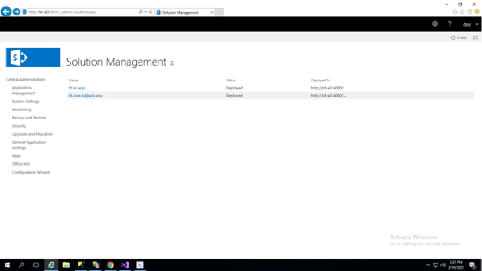
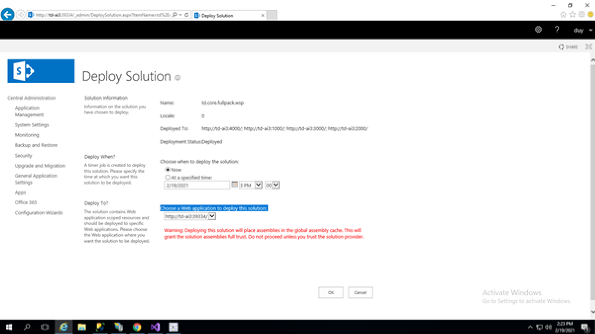

Sau khi tạo web application và 3 site, kiểm tra xem cổng của web application đã được cài đặt core hay chưa
Vào **System setting** → **Manage Farm solutions**

Chọn `td.core.fullpack.wsp` → **Deploy solution**

Chọn cổng muốn deploy → <b>Ok</b>
